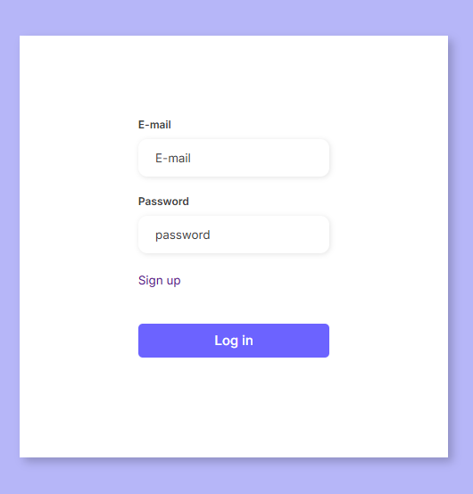

# Fórmulário




> Contexto

Um projeto que tem como objetivo fazer uma página de cadastro que logo após você pode validar o acesso colocando seu email e senha que foram cadastrados
no banco de dados do sql lite, utilizando o JWT para fazer o intermédio da conexão duradoura com os dados do usuário logado.

---

## Funcionalidades

-   ✅ Registro de usuário
-   ✅ Login com geração de Access Token
-   ✅ Proteção de rotas com middleware JWT

---

## Tecnologias e Ferramentas

-   Node.js
-   Express
-   Prisma + SQLite
-   JWT (jsonwebtoken)
-   dotenv
-   bcrypt (para hash de senhas)
-   HTML5
-   CSS3
-   JavaScript
-   nodemon (para desenvolvimento)

---

## Instalação

1. Clone o repositório:

```bash
git clone https://github.com/Rafael19722/att-formulario-cadastro.git
```

2. instale as dependências:

```bash
npm install
```

3. configure o arquivo .env:

```bash
DATABASE_URL="file:./dev.db"
JWT_SECRET=suaChaveSecreta
```

4. Configure e execute as migrations do banco:

```bash
npx prisma migrate dev --name init
```

5. Entre na pasta src no terminal:

```bash
cd src
```

6. Rode o projeto:

```bash
node server.js
```

## Contato

rafael.profissional011@gmail.com
